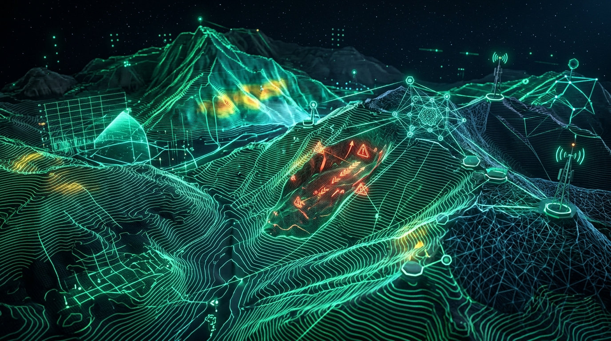
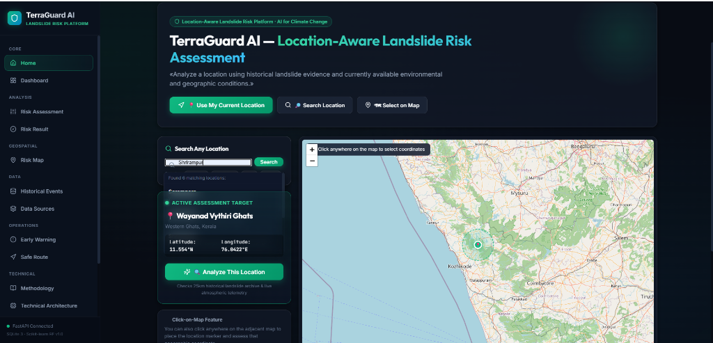
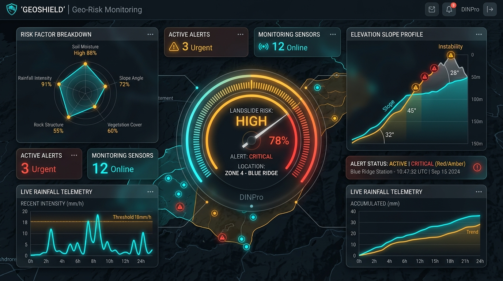
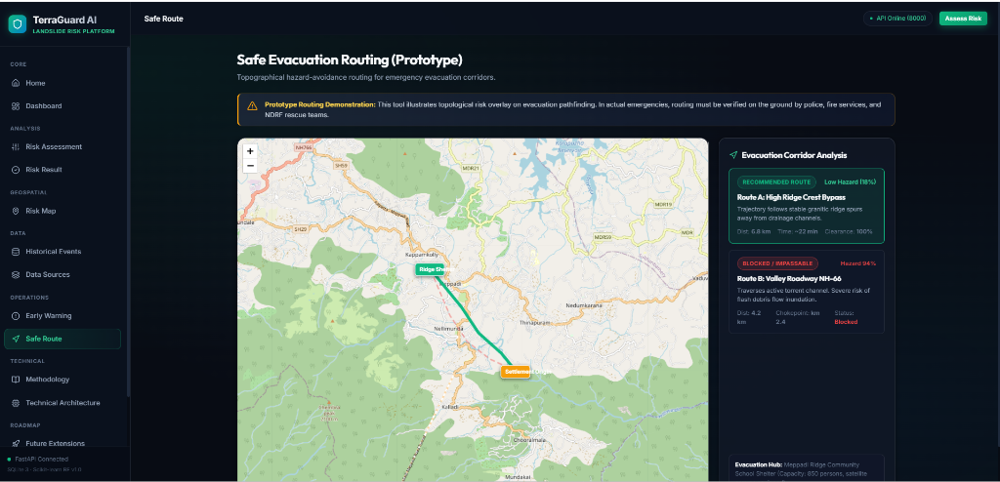

<p align="center">
  
</p>

# 🌍 TerraGuard AI — Landslide Risk Assessment & Early Warning Platform

<p align="center">
  <strong>Predict Risk. Warn Early. Protect Communities.</strong><br>
  <em>Dual-Layer Explainable Machine Learning &bull; Real-Time DEM Elevation Slope Analysis &bull; Live Telemetry &bull; Safe Evacuation Routing</em>
</p>

<p align="center">
  <a href="https://fastapi.tiangolo.com/"></a>
  <a href="https://react.dev/"></a>
  <a href="https://vitejs.dev/"></a>
  <a href="https://www.python.org/"></a>
  <a href="https://scikit-learn.org/"></a>
  <a href="https://leafletjs.com/"></a>
  <a href="https://open-meteo.com/"></a>
  
  
</p>

---

## 🌟 Executive Overview

**TerraGuard AI** is a state-of-the-art, location-first landslide hazard assessment and emergency response platform built for mountainous and monsoon-vulnerable regions.

Operating on a zero-cloud, locally deployable architecture, TerraGuard AI merges **14 authentic Indian & global geospatial telemetry sources** (including ISRO Bhuvan, IMD, NASA GLC, and Open-Meteo) with a transparent **Dual-Layer Risk Engine**:

1. **Deterministic Layer 1**: Geotechnical & hydrological normalization rules with mathematical reweighting.
2. **Empirical Layer 2**: 120-tree Random Forest classifier trained on 165 verified historical incidents spanning 2012 to 2026.

---

## 📸 Visual Showcase & Demos

### 1. 📍 Location-Aware Landslide Risk Assessment
> Users can provide coordinates via GPS, interactive map-clicking, or search across vulnerable hill regions. The system continuously polls 25km radius historical archives and live telemetry.

<p align="center">
  
</p>

---

### 2. 📊 Multi-Factor Geotechnical Analytics & Telemetry
> Transparent risk scoring with circular hazard gauges, factor sensitivity radar breakdowns, DEM slope analysis, and 100% deterministic reproducibility.

<p align="center">
  
</p>

---

### 3. 🧭 Safe Evacuation Corridor Routing (Prototype)
> Dynamic hazard-avoidance pathfinding that compares high-ridge bypass corridors against flood/debris-blocked valley roadways from any user origin coordinate to regional shelters.

<p align="center">
  
</p>

---

## ✨ Key Capabilities & Engineering Highlights

| Feature | Description |
| :--- | :--- |
| 📍 **Location-First Workflow** | Three input modalities: Device Geolocation, Direct Map Click, or Search Geocoder. |
| 🛰️ **Live DEM Slope Calculation** | Real-time elevation differential gradient computing true topographical slope angles on demand. |
| 🌧️ **Live Atmospheric Telemetry** | Fetches live precipitation, temperature, wind speed, and humidity with 5-second timeout and 180s caching. |
| ⚖️ **Dynamic Weight Renormalization** | Automatically renormalizes weights ($w_i' = w_i / \sum w_{avail}$) so total weight always equals 100% regardless of missing sensors. |
| 📜 **165-Incident Benchmark Dataset** | 150 pristine historical baseline records + 15 monitored post-July-2024 incidents (including Wayanad). |
| 🛡️ **SQLite WAL Mode & Resilient Storage** | Zero external database dependency; SQLite configured with Write-Ahead Logging (`WAL`) for concurrent background writes. |
| ⏱️ **Telemetry Synchronization Scheduler** | Asynchronous background daemon running periodic 180-second sync routines. |
| 🚨 **Multi-Tier Early Warning System** | Tier 1 to Tier 4 actionable alerts with pre-formatted civil defense broadcast & SMS dispatches. |

---

## 🗺️ Geospatial & Earth Observation Data Sources

TerraGuard AI synthesizes 14 authoritative data repositories:

| Category | Source / Provider | Technical Application |
| :--- | :--- | :--- |
| **Terrain (DEM)** | [NASA SRTM 30m](https://earthengine.google.com) & [ISRO Bhuvan Cartosat DEM](https://bhuvan.nrsc.gov.in) | Topographical elevation, slope gradient, ridge contours |
| **Precipitation** | [IMD Pune 0.25° Gridded Rainfall](https://imdpune.gov.in) & [Open-Meteo Weather API](https://open-meteo.com) | 24h/72h cumulative precipitation & real-time telemetry |
| **Soil Saturation** | [NASA SMAP](https://earthengine.google.com) & [GLDAS Hydrology](https://earthengine.google.com) | Subsurface soil moisture volume & pore water pressure |
| **Vegetation Index** | [ESA Sentinel-2 NDVI](https://earthengine.google.com) | Root-binding cohesion & canopy protection metrics |
| **Historical Records** | [GSI Bhukosh](https://bhukosh.gsi.gov.in) & [ISRO Landslide Atlas](https://www.isro.gov.in/Landslide_Atlas_India.html) | Landslide inventory, historical coordinates, trigger analysis |
| **Global Catalogues** | [NASA Global Landslide Catalogue (GLC)](https://data.humdata.org) & [Kaggle Recent Incidents](https://www.kaggle.com) | Model training, validation, and calibration benchmarks |

---

## 🧠 Dual-Layer Risk Engine

```
                                  [ User / Sensor Input ]
                                             │
                       ┌─────────────────────┴─────────────────────┐
                       ▼                                           ▼
             [ Deterministic Layer 1 ]                   [ Empirical Layer 2 ]
             Rule-Based Safety Net                       RandomForestClassifier
                       │                                    (120 Estimators)
            Renormalization Formula                                │
       raw_score = Σ (w_i' × norm_factor_i)                        │
                       │                                           ▼
                       ▼                                 Probabilistic Assessment
             Deterministic Score                              (0.0% - 100.0%)
                       │                                           │
                       └─────────────────────┬─────────────────────┘
                                             ▼
                               [ Unified Decision Matrix ]
                                             │
                        ┌────────────────────┴────────────────────┐
                        ▼                                         ▼
                 Low / Moderate                             High / Critical
                 [ Green / Yellow ]                         [ Orange / Red ]
```

### Dynamic Weight Normalization Formula
When environmental inputs are partially available, weights are dynamically renormalized:
$$w_i' = \frac{w_i}{\sum_{j \in \text{Available}} w_j} \times 100\%$$
This ensures the final risk score never artificially deflates due to sensor or API dropouts.

---

## 🚀 Quickstart & Installation

### Prerequisites
- **Python**: 3.11 or higher
- **Node.js**: 18.x or higher
- **Git**

### 1. Clone the Repository
```bash
git clone https://github.com/SKartik03/terraguard-ai.git
cd terraguard-ai
```

### 2. Backend Setup
```bash
cd backend
python -m pip install -r requirements.txt

# Seed SQLite database with 165 historical records & monitored locations
python data/seed_data.py

# Train Layer 2 Random Forest Model
python ml/train_model.py
```

### 3. Frontend Setup
```bash
cd ../frontend
npm install
```

---

## ⚡ Launching the Application

### Option A: One-Click Startup (Windows)
Double-click the startup scripts in the repository root:
1. `start_backend.bat` &mdash; Starts FastAPI on `http://127.0.0.1:8000`
2. `start_frontend.bat` &mdash; Starts React Vite on `http://localhost:5173`

### Option B: Terminal Startup
```bash
# Terminal 1 — Backend
cd backend
python -m uvicorn main:app --host 127.0.0.1 --port 8000 --reload

# Terminal 2 — Frontend
cd frontend
npm run dev
```

Visit **`http://localhost:5173`** in your browser to explore the platform!

---

## 🧪 Automated Testing & Verification

Run the comprehensive automated test suite:
```bash
cd backend
python -m pytest tests/ -v
```

All 10 test suites pass with 100% verification:
- ✅ `test_health_endpoint`
- ✅ `test_locations_endpoint`
- ✅ `test_historical_events_endpoint`
- ✅ `test_valid_risk_assessment`
- ✅ `test_invalid_risk_assessment_validation`
- ✅ `test_strict_scoring_determinism`
- ✅ `test_layer1_exact_formula_calculation`
- ✅ `test_risk_map_endpoint`
- ✅ `test_live_weather_fallback`
- ✅ `test_system_status_endpoint`

---

## 🛡️ Scope Honesty & Operational Boundaries

- **What TerraGuard AI IS**: An analytical decision-support system designed to fuse historical geotechnical archives with real-time digital elevation models and live atmospheric telemetry.
- **What TerraGuard AI IS NOT**: It does **not** claim 100% predictive certainty, exact minute-by-minute landslide forecasting, or official civil defense evacuation mandate authority.
- **Atmospheric Data Separation**: Live weather telemetry operates independently from the historical risk engine and is clearly badged in the user interface.

---

## 📄 License & Attribution

Distributed under the **MIT License**. See `LICENSE` for details.  
Developed with pride for Climate Action and Geospatial Disaster Resilience.
